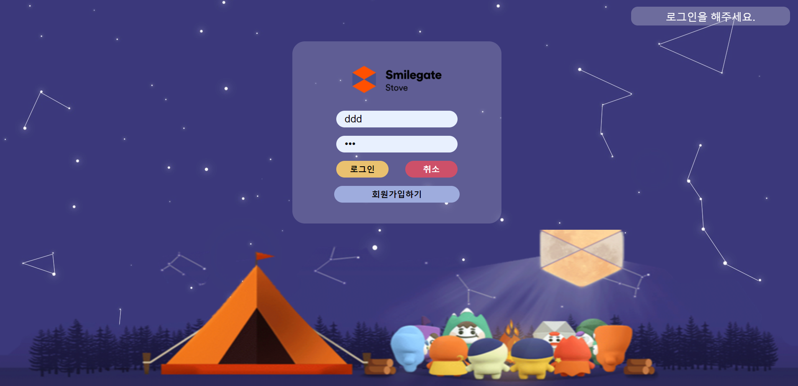

# [SGD 개인과제] Auth

[TOC]

## 개요

### 사용 기술

[백엔드] Django, Django Rest Framework

[프론트엔드] Vue, Vuex

[데이터베이스] MySQL 

### 요구사항 정의

[로그인 페이지]

* 유저 아이디 입력칸, 비밀번호 입력 칸(data binding), 로그인 버튼, 회원가입버튼

* 아이디 또는 비밀번호 틀릴 경우 틀렸다는 알림이 뜨도록한다.(프론트처리)

* 비밀번호 입력시 로 보이지 않게 처리

* 회원가입 버튼 클릭시 가입페이지로 이동.

* 로그인 클릭시 로그인 성공페이지 띄우기

  [로그인 성공페이지] : 스마일게이트 캐릭터들이 통통 뛰고 있기

[회원가입 페이지]

* 유저이름, 유저 아이디 입력창, 비밀번호 입력창, 비밀번호확인창, 회원가입버튼, 취소버튼
* 아이디 조건, 비밀번호 조건 placeholder로 띄워놓기
* 아이디와 비밀번호가 조건에 어긋나면 경고 문구뜨게 만들기
* 회원가입 클릭시 회원가입 성공 문구 뜨고 로그인 페이지로 이동해달라는 문구뜸
* 알림이후 로그인페이지로 이동

[admin 페이지]

* 관리자로 로그인할 경우 해당 페이지로 이동

* 유저 전체정보 가져오기

==아래 사항은 현재 추가중

* 비밀번호는 암호화되어 보이기. 비밀번호 초기화

* 유저 추가

* 유저 삭제

  ​

[추가사항]

이메일 인증

비밀번호 찾기

### 아키텍쳐

### User Table

| column    | content                 |
| --------- | ----------------------- |
| id        | 자동 부여 고유값               |
| username  | 아이디                     |
| password  | 비밀번호 ( 암호화)             |
| phone     | 전화번호                    |
| email     | 이메일                     |
| is_admin  | 관리자 여부                  |
| is_active | 활성화 여부 (탈퇴시 deactivate) |

## 개발 과정

#### [백엔드](./assets/backend.md)

#### [프론트엔드](./assets/frontend.md)

### 메인화면

[참고]https://dora-guide.com/mysql-insert-update-delete/

