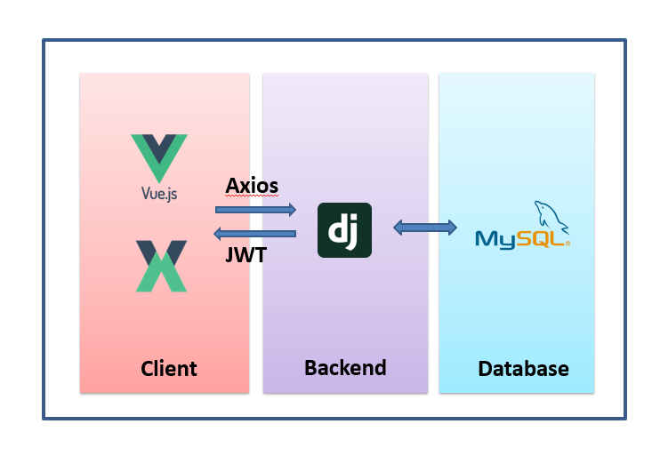
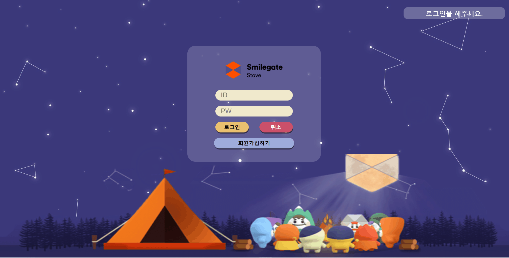
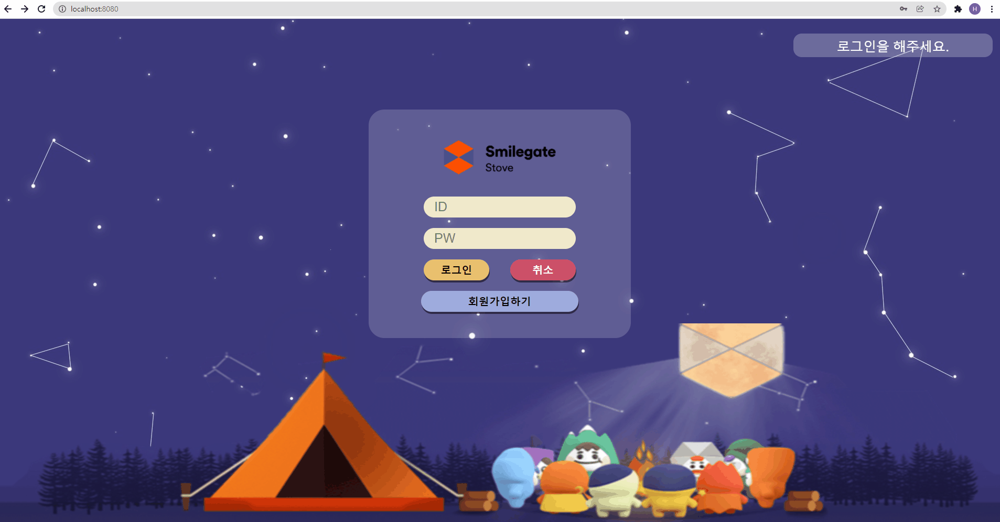
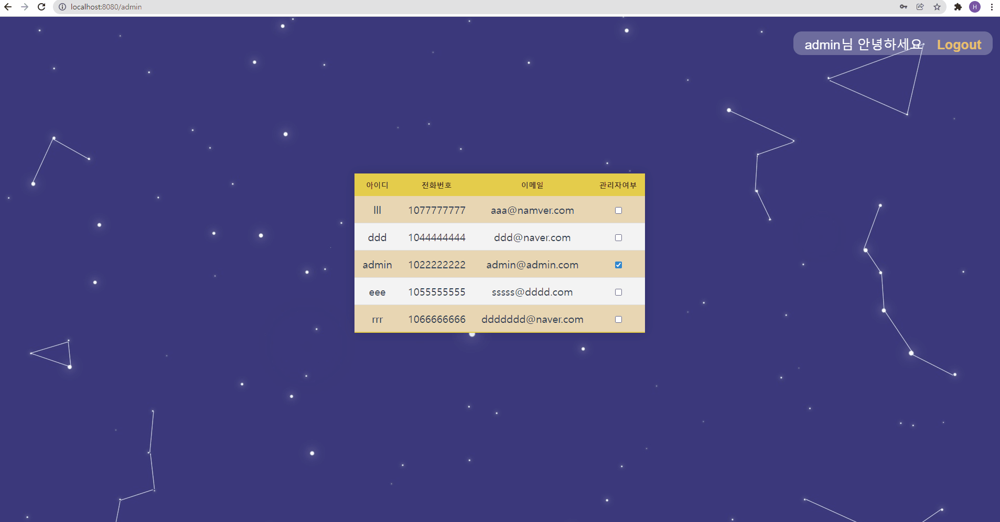

# [SGD 개인과제] Auth

[TOC]

## 개요

### 목표

☘ 기본기능 완성을 최우선 목표로한다.

* 백엔드 구현시 프레임워크가 제공하는 기술을 최소한으로 사용해 구현한다.

☘ 버튼 클릭후 페이지 이동을 하거나 데이터가 변경되는 경우 새로고침이 되도록 일어나지 않게 구현하다.

☘ 개발과정 전반과 trouble shooting을 잘 기록해둔다.


### 사용 기술

[백엔드] Django, Django Rest Framework

[프론트엔드] Vue, Vuex

[데이터베이스] MySQL 


### 아키텍쳐




### User Table

| column    | content                 |
| --------- | ----------------------- |
| id        | 자동 부여 고유값               |
| username  | 아이디                     |
| password  | 비밀번호 ( 암호화)             |
| phone     | 전화번호                    |
| email     | 이메일                     |
| is_admin  | 관리자 여부                  |
| is_active | 활성화 여부 (탈퇴시 deactivate) |


### 요구사항 정의

> 모든 페이지는 새로고침을 최소화하도록 구현한다.

[로그인 페이지]

* 유저 아이디 입력칸, 비밀번호 입력 칸, 로그인 버튼, 회원가입버튼

* 아이디 또는 비밀번호 틀릴 경우 틀렸다는 알림이 뜨도록한다.

* 비밀번호 입력시 보이지 않게 처리

* 회원가입 버튼 클릭시 가입페이지로 이동.

* 로그인 클릭시 로그인 성공페이지로 이동

  [로그인 성공페이지] : 스마일게이트 캐릭터들이 통통 뛰고 있는 페이지

* 로그인에 성공하면 유저이름과 함께 환영문구가 뜨고 로그아웃 버튼이 생성된다.

* 로그아웃 버튼 클릭시 로그아웃된다.

[회원가입 페이지]

* 유저이름, 유저 아이디 입력창, 비밀번호 입력창, 비밀번호확인창, 회원가입버튼
* 아이디 조건, 비밀번호 조건 placeholder로 띄워놓기
* 아이디와 비밀번호가 조건에 어긋나면 경고 문구 뜨게 만들기
* 이메일과 번호가 양식에 맞지않는경우 경고 문구 뜨게 만들기
* 모든 양식이 지켜지면 경고문구가 사라진다.
* 회원가입 클릭시 회원가입 성공 문구 뜨고 로그인 페이지로 이동 알림 뜸
* 알림이후 로그인페이지로 이동

[admin 페이지]

* 관리자로 로그인할 경우 해당 페이지로 이동


* 유저 전체정보 가져오기
* 유저를 관리자로 지정하거나 관리자 권한을 뺏기


[추가사항]

유저 추가 및 삭제 (필요시)

이메일 인증

비밀번호 찾기


## 주요 기능

### 1. 로그인 기능

- 아이디와 패스워드를 입력해 로그인 할 수 있다. 이때 비밀번호는 보이지 않는다.
- 아이디 또는 비밀번호가 틀릴  경우에는 틀렸다는 알림이 뜨도록 한다.
- 아이디 또는 비밀번호 틀릴 경우 틀렸다는 알림이 뜬다.
- 일반 유저가 로그인에 성공하면 스마일게이트 캐릭터가 통통 뛰고 있는 로그인 성공페이지로 이동한다.
- 관리자가 로그인에 성공하면 관리자페이지로 이동한다.
- 로그인에 성공하면 유저이름과 함께 환영문구가 뜨고 로그아웃 버튼이 생성된다.
- 로그아웃 버튼 클릭시 로그아웃된다.


**[관리자로 로그인 하는 방법]**

`python manage.py makemigrations //   migrate`까지 과정 완료 후

`python manage.py loaddata data.json`을 입력해 등록해둔 데이터를 불러온다.

아이디 : admin , 비밀번호: 123으로 로그인하면 관리자로 로그인이 가능하다.

[일반 유저가 로그인한 경우]



[관리자가 로그인한 경우]


### 2. 회원가입 기능

* 입력해야하는 항목의 칸에 양식의 예시가 써져있다.
* 양식에 맞지 않은 경우 해당 칸 하단에 경고문구가 뜬다.
  * 유저의 아이디는 1자 이상 20자이하이다.
  * 비밀번호는 8자 이상 16자 이하이다.
  * 전화번호는 010으로 시작하는 11자리 숫자이다.
  * 이메일은 @를 반드시 포함하는 메일주소 형식이다.
* 양식에 맞게 작성할 경우 경고 문구가 사라진다.
* 모든 경고문구가 사라지고 회원가입 버튼을 누르면 가입에 성공했다는 알림이 뜬다.
* 알림이 뜬 후에는 로그인페이지로 이동한다.

[회원가입]




### 3. 관리자 페이지

* 관리자계정으로 로그인할 경우 모든 유저목록을 볼 수 있는 페이지로 이동한다.
* 유저 아이디와 비밀번호, 이메일을 확인할 수 있다.
* 관리자여부의 체크박스를 클릭하면 관리자로 지정할 수 있다.
* 관리자여부의 체크박스를 클릭해 해제하면 관리자권한을 빼앗을 수 있다.




## 개발 과정 및 Trouble Shooting

### 1. 유저 모델 생성

#### [Backend]

##### 🌷내장 기능 구현법

* Django 에는 기본적으로 제공하는 User모델이 있다. 이를 사용하면 따로 모델링을 해주지 않아도 기본 shema를 바로 생성할 수 있다.

> models.py

```python
from django.db import models
from django.contrib.auth.models import AbstractUser

class User(AbstractUser):
    pass
```

* Django 에서는 [PBKDF2](https://en.wikipedia.org/wiki/PBKDF2) 라는 기본 암호화 시스템을 제공중이다. 현재는 이를 사용해 구현되어있다.

[참고] https://velog.io/@dev_dolxegod/Django-Authentication-System%EC%9D%98-%EB%AA%A8%EB%93%A0-%EA%B2%83-1-authuser-%EA%B8%B0%EB%B3%B8

##### 🌻직접  + 응용 구현

> models.py

* 기본 제공해주는 User model을 바탕으로 해당 속성값을 지정해주고 추가적인 학목을 커스텀해 제작했다.


* 사용자에는 관리자와 관리자가 아닌 일반 사용자라는 2가지 종류가 있으므로 

  일반 유저) `is_admin : 0`, 관리자) `is_admin : 1` 로 지정해주었다.

  유저아이디) 20자 이하로 설정하였다. (환영인사 tempate 칸수를 고려하였다.)

  이메일) 최대 255자 지원이라는 레퍼를 보고 설정하였다.

  **유저 자격의 확장성을 위해 Bool이 아닌 Int 필드로 생성하였다.**

```python
from phonenumber_field.modelfields import PhoneNumberField

class User(AbstractBaseUser):
    id = models.AutoField(primary_key=True)
    username = models.CharField(default='', max_length=20, null=False, blank=False, unique=True)
    email = models.EmailField(default='', max_length=255, null=False, blank=False, unique=True)
    phone = IntegerField(default=0, null=False, blank=False, unique=True)
    is_active = models.IntegerField(default=0)    
    is_admin = models.IntegerField(default=0)
    
    # 헬퍼 클래스 사용
    objects = UserManager()

    # 사용자의 username field는 username으로 설정
    USERNAME_FIELD = 'username'
    # 필수로 작성해야하는 field
    REQUIRED_FIELDS = ['password', 'email', 'phone']

    def __str__(self):
        return self.username
```

* 커스텀 모델을 일반유저인지 관리자인지에따라 생성해주는 관리자 모델도 추가 제작하였다.
* 관리자는 시스템에서 부여해주는 형태로 제작해두었다. 

```python
class UserManager(BaseUserManager):
    # 일반 user 생성
    def create_user(self, email, phone, username, password=None):
        if not email
            raise ValueError('no user email')
        if not phone:
            raise ValueError('no user phone')
        if not username:
            raise ValueError('no user username')
        user = self.model(
            email = self.normalize_email(email),
            phone = phone,
            username = username
        )
        user.set_password(password)
        user.save(using=self._db)
        return user

    # 관리자 user 생성
    def create_superuser(self, email, username, phone=None, password=None):
        if phone is None:
            phone = 0
        user = self.create_user(
            email,
            password = password,
            phone = phone,
            username = username
        )
        user.is_admin = 1
        user.save(using=self._db)
        return user

```


##### 🌹구현시 문제점

1. 전화번호를 위한 field인 phoneNumberField가 읽히지 않았다.

   django 의 phoneNumberField는 pip설치로 간단히 사용할 수 있음에도 해당 필드 사용시 정보를 추가하는 것에서 에러가 계속해서 발생했다. 이를 해결하기 위해 client에서 핸드폰 번호를 양식에 맞게 요청하도록 설정하였기에 백엔드 모델에서는 일반적인 숫자필드인 IntegerField를 사용하였다.

2. Django에서 제공하는 User모델을 Custom하여 사용하는 것이 오히려 새로 만드는 것보다 어려웠다.

   처음 백엔드를 하는만큼 기존에 제공되는 부분을 직접구현하거나 커스텀하여 사용해보는 것이 1차 목표였기에 유저테이블을 위한 모델을 기본 제공되는 User모델을 사용해 커스텀해보도록 하였다. 하지만 아예 필드를 지정해 새로 만드는 것이 더욱 편리했을 것으로 보인다. Django의 유저모델은 개인정보를 위한 테이블인만큼 보안관리와 형식에서 일반 모델과 다른 기능들이 내장되어있었고 이에 필드를 수정하거나 추가하기위해 커스텀을 할 경우 다양한 에러에 봉착하였다. "phone"이라는 전화번호 저장을 위한 필드를 추가해보면서 이러한 문제들을 해결해나갔다.


### 2. 로그인 기능

#### [백엔드]

##### 🌷 내장 기능으로 구현법

* Django 에는 obtain_jwt_token 이라는 jwt를 자동 생성해서 보내주는 기능이 있다.

> accounts > urls.py

```python
from rest_framework_jwt.views import obtain_jwt_token
from django.urls import path
from . import views

path('api-token-auth/', obtain_jwt_token),

```

##### 🌻 직접 구현

* 내장 기능 구현 대신 직접 jwt 를 생성하고 원하는 정보를 보내줄 수 있도록 만들어보았다.

> accounts > urls.py

```python
from django.urls import path
from . import views

urlpatterns = [
    path('login/', views.login),
]

```


> views.py

* 통신에 성공하였지만 양식이 적합하지 않거나 오류가 있는 경우에는 200을 보내지만 에러사항을 담아서 보내주어야한다. 로그인의 경우 요청은 잘 왔으나 비밀번호가 다른 경우와같이 정보가 다른 경우에는 해당 문제를 보내준다.

🌹구현시 문제점

1. 비밀번호는 암호화되어 저장되기 때문에 비교를 위해서는 꼭 check_password를 사용해 확인해주어야만 한다!
2. Json형태로 응답을 해주는 경우에는 원하는 메세지를 입력했을때 인코딩문제가 발생하기도한다. 이는 EmployeeEncoder로 json형식을 담은 변수를 인코딩하여 보내주면 된다.

```python
from django.http.response import JsonResponse
from json import JSONEncoder

@api_view(['POST'])
def login(request):
    username = request.data.get('username')
    password = request.data.get('password')
    user = get_user_model().objects.get(username=username)
    # 암호화된 비밀번호와 입력된 비밀번호가 같은지 확인해주고 같다면 성공메시지와 함께 토큰발급
    if check_password(password, user.password):
        context = {
            'response': 'success',
            'message': 'sucess login',
            'user': user,
            'token': jwt_create(username)
        }
    # 정보가 틀리다면 통신은 성공했으니 에러는 띄우지 않지만 실패메시지를 보낸다.
    else:
        context = {
            'response': 'fail',
            'message': "password doesn't match",
        }
    return JsonResponse(EmployeeEncoder().encode(context), safe=False)

def jwt_create(username):
    now = datetime.now()
    key = settings.SECRET_KEY
    now_time = str(now.year)+str(now.month)+str(now.day) + \
        str(now.hour)+str(now.minute)+str(now.second)
    payload = {
        "username": username,
        "now_time": now_time
    }
    jwt_token = jwt.encode(payload, key, algorithm='HS256').decode('utf-8')
    return jwt_token

# subclass JSONEncoder
class EmployeeEncoder(JSONEncoder):
    def default(self, o):
        return o.__dict__
```


### 3. 회원가입 기능

#### [프론트엔드]

> Signup.vue

* 회원가입은 사용자가 양식을 정확히 입력했는지, 틀렸다면 어느부분이 틀렸는지 파악할 수 있어야하기에 client부분에 많은 시간을 사용하였다.
* 사용자가 정보를 입력할때마다 양식이 적합한지 확인해야만 양식에 맞는지 현상황을 파악할 수 있다. 따라서  변동사항을 지켜보고 있도록 구현했으며 위에 작성한 요구사항에 부합하기 전까지는 양식이 틀린 입력칸 하단에 경고문구가 뜨고 부합하면 경고문이 사라지도록 구현하였다.

```javascript
... 
checkform() {
      this.isSubmit = false;
      // 아이디의 길이가 1자 이상, 20자 이하인가?
      if (this.credentials.username.length <= 0 || this.credentials.username.length > 20) {
        this.error.username = 'notValid';
        return;
      } else this.error.username = true;

       // 비밀번호가 적합한가?
      if (!this.passwordSchema.validate(this.credentials.password)) {
        this.error.password = 'notValid';
        return;
      } else this.error.password = true;

      // 비밀번호 확인
      if (this.credentials.passwordConfirmation.length > 0 && this.credentials.password != this.credentials.passwordConfirmation) {
        this.error.passwordConfirmation = 'notSame';
        return;
      } else this.error.passwordConfirmation = true;

      // 이메일 형식이 맞는가?
      if (!EmailValidator.validate(this.credentials.email)) {
        this.error.email = 'styleError';
        return;
      }

      // 이메일 길이가 1글자 이상, 255글자이하이다.
      else if (this.credentials.email.length <= 0 || this.credentials.email.length >= 255) {
        this.error.email = 'lengthError';
        return;
      } else this.error.email = true;

      // 전화번호양식
      if (this.credentials.phone.length != 11 || this.credentials.phone.slice(0, 3) != '010') {
        this.error.phone = 'notValid';
        return;
      } else this.error.phone = true;

      this.isSubmit = true;
    },
  },
  // 입력 변수 감시
  watch: {
    'credentials.username': function() {
      this.checkform();
    },
    'credentials.phone': function() {
      this.checkform();
    },
    'credentials.email': function() {
      this.checkform();
    },
    'credentials.password': function() {
      this.checkform();
    },
    'credentials.passwordConfirmation': function() {
      this.checkform();
    },
  },
  created() {
  // 패스워드 규칙. 최소 8자 ~ 최대 16자. 숫자와 문자 포함해야함.
  this.passwordSchema
    .is()
    .min(8)
    .is()
    .max(16)
    .has()
    .digits()
    .has()
    .letters();
  },
```


#### [백엔드]

> views.py

* 모든 양식을 갖추어 요청이 들어왔을때 이를 검토한다.
* 모델을 직렬화한 형태에 해당 요청 데이터를 저장해주면 새로운 유저정보가 생성된다.

```python
@api_view(['POST'])
def signup(request):
	# clietn 요청에서 data를 맏아 담아준다.
    password = request.data.get('password')
    password_confirmation = request.data.get('passwordConfirmation')
	# 비밀번호와 비밀번호 확인이 동일한지 체크 : 동일하지 않다면 400에러가 메세지와 함께 보내진다. (이미 client에서도 막음)
    if password != password_confirmation:
        return Response({'error': '비밀번호가 일치하지 않습니다.'}, status=status.HTTP_400_BAD_REQUEST)
	# UserSerializer로 데이터 직렬화
    serializer = UserSerializer(data=request.data)
	#3. validation 작업 진행 -> password도 같이 직렬화 진행
    if serializer.is_valid(raise_exception=True):
        user = serializer.save()
        #4. 비밀번호 해싱 후 
        user.set_password(request.data.get('password'))
        user.save()
        # password는 직렬화 과정에는 포함 되지만 → 표현(response)할 때는 나타나지 않는다.
        return Response(serializer.data, status=status.HTTP_201_CREATED)
```

**❓[질문사항]**

- 비밀번호입력값과 비밀번호확인입력값이 같음을 확인하는 경우 프론트와 백 둘다 처리해주는 것이 맞는지, 프론트에서만 처리해주는 것이 맞는지?

  [프론트에서 처리]

  ```javascript
  // 비밀번호입력값 == 비밀번호확인값
        if (this.credentials.password == this.credentials.passwordConfirmation){
         .... 요청보내기
        }
  // 비밀번호입력값 != 비밀번호확인값
  	else{
          alert('입력하신 비밀번호와 비밀번호 확인값이 다릅니다.')
        }// 비밀번호입력값 == 비밀번호확인값        
  ```

  [백엔드에서 처리]

  ```python
  #1-1. Client에서 온 데이터를 받아서
  password = request.data.get('password')
  password_confirmation = request.data.get('passwordConfirmation')

  #1-2. 패스워드 일치 여부 체크
  if password != password_confirmation:
      return Response({'error': '비밀번호가 일치하지 않습니다.'}, status=status.HTTP_400_BAD_REQUEST)
  		
  ```


## 느낀점 및 향후 도전 과제

처음으로 사용자 인증 부분에서 백엔드와 프론트엔드를 데이터베이스까지 활용해 직접구현해보았다. 일반적인 정보전달 페이지와는 다르게 사용자정보를 다루는 부분에서 어려운 부분들이 있었다.  백엔드를 처음 다루어보면서 기본적인 테이블 생성과 응답과정에서도 생각보다 많은 시간이 소요되었고 최대한 프레임워크의 내장기술을 적게 활용하기 위해 직접 JWT를 만들어보거나 원하는 형태로 크라이언트에 응답하기 위해 구현하는 부분 등 모든 부분이 어려웠지만 동시에 백엔드에서 어떠한 사항을 신경써야하고 어떠한 플로우로 흘러가는지를 조금이나마 이해할 수 있었다. 이후에는 시간상 직접 구현해보지 못한 "비밀번호 암호화(salt 활용), MSA, 이메일 인증" 을 백엔드까지 구현해보고싶다. 또한 사용자 데이터는 일정시간동안은 완전한 삭제보다는 비활성화시키고 다른 공간에 백업을 해둔다고 들었는데, 이를 위해 user model에 active 필드를 남겨둔만큼 database를 분리해 사용하는 부분도 도전해보고싶다.


